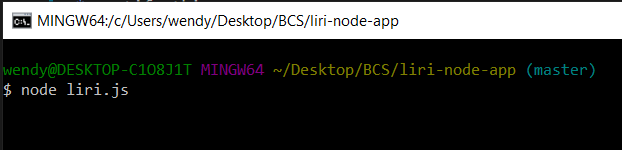
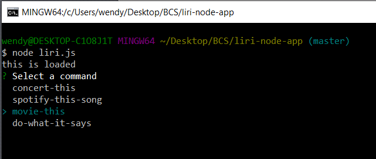
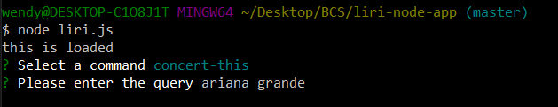
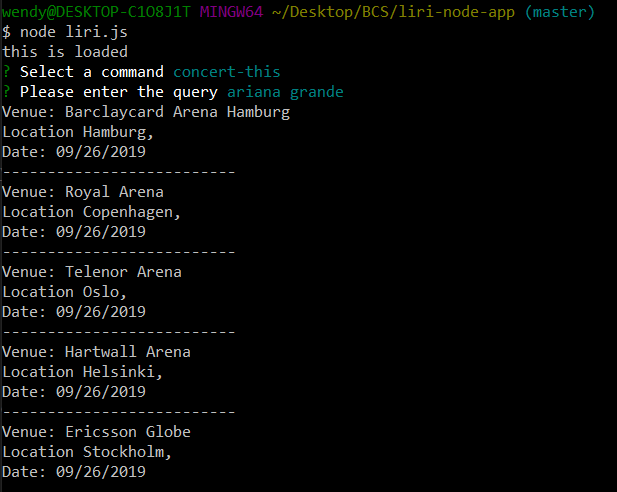
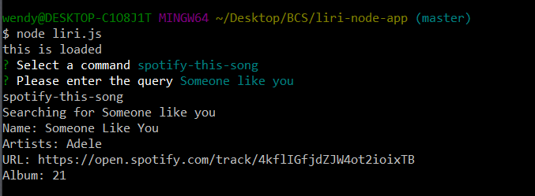
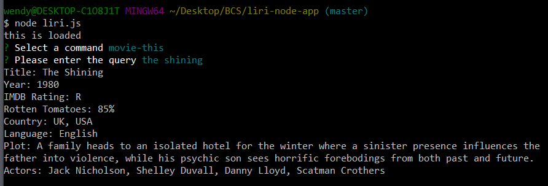
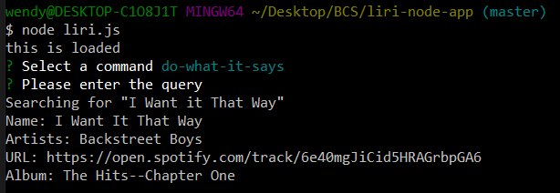

# liri-node-app

## Description

LIRI is like iPhone's SIRI. LIRI is a *Language Interpretation and Recognition Interface*. LIRI is be a interactive app that allows the user to chose a command from the folowwing list:

* concert-this
* spotify-this-song
* Movie-this
* do-what-it-says

The user might as well choose a search query within that category, by typing it into the command line, and get information back printed on the console.

## Organization

The app is organized in two modules. One is the [keys.js] file and the second is [liri.js]. Inside [keys.js] live the Spotify API keys only. Inside [liri.js] are the methods that inquire the user and those that retrieve the user's input to triger the user's chosen command.

When the user makes their command selection, the app calls a `doEverything` method and pass the user's command and search query as arguments. `doEverything` takes the parameters and uses the `switch` method to discriminate between commands and trigger their respecting function.

## Technologies

* Javascript
* Node.js
    * NPM Packages
        * dotEnv
        * Spotify API
        * Axios
            * Bands in Town API
            * OMDB API
        * Moment.js
        * Inquirer
    * FS

## User's guide

1. First off, make sure you have Node.js installed in your computer. Second,open the console and clone this repo into the folder you want to store the app. For windows, use the following command:

```
git clone <link of the repo>
```

Next, navigate to the newly created app's directory. Then, create a [package.json] file: 

```
npm init -y
```

and install the dependencies

```
npm install
```

You'll need to use you're own Spotify API key.

2. To run the app, navigate to it's directory and type:

```
node liri.js
```

Since this app is interactive, it doesn't need arguments. The user will input the data later on.





3. Second, the app will show you the list of commands. Use the `down arrow` key to navigate through it and click `Enter` once you've made a selection. For this example, we will choose **concert-this**.





4. Now it's time to give the app a search query. Type the name of the artist, song, or movie you want information about, and hit the `Enter` key. For this example, we will use **Ariana Grande**.





5. The app now will show you a list of the next following events for that specific artist, including the venue, location, and date of the concert.




6. The other commands work similarly. Here are some examples of the possible results:

    * **spotify-this-song**
    
    

    * **movie-this**

    

    * **do-what-it-says** Reads the command and query from a `random.txt` file. In this case, when the app asks for a query, just hit enter.

    

## Github

To get this app's repo, visit [Gitub](https://github.com/wendygarcia84/liri-node-app)

## Contact me

This proyect is created and maintained by *Wendy Garcia*. 
Contact me: <wendy.fern84@gmail.com>